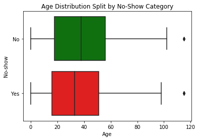
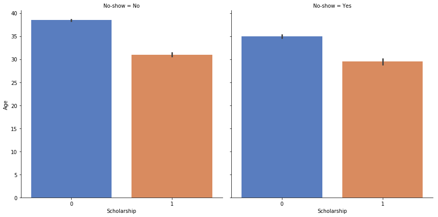

# Project: Investigating Appointments With No-Show Patients

## Table of Contents
<ul>
<li><a href="#intro">Introduction</a></li>
<li><a href="#wrangling">Data Wrangling</a></li>
<li><a href="#eda">Exploratory Data Analysis</a></li>
<li><a href="#conclusions">Conclusions</a></li>
</ul>

<a id='intro'></a>
## Introduction

> I will be exploring the No Show Patient Appointments dataset.
> I downloaded the No Show Appointments dataset and saved it as 'noshow.csv'.
> Using the Udacity provided Jupyter Notebook template I imported all the packages that might be needed.
> Some questions I look to answer through analyzing this dataset include:
>
> 1) Does age (younger or older) have any kind of impact or relationship in terms of people showing up for appointments or not?
>
> 2) Does the combination of age and scholarship have some kind of impact or relationship in terms of people showing up for appointments or not?
>

### Import Packages


```python
import pandas as pd
import numpy as np
import matplotlib.pyplot as plt
import seaborn as sns
% matplotlib inline
```

<a id='wrangling'></a>
## Data Wrangling

> My initial attempt to read the CSV file led to the following error:
> “UnicodeDecodeError: 'utf-8' codec can't decode byte 0xed in position 3: invalid continuation byte”.

> A quick Google search led to me to this StackOverflow question and the answer I needed to solve this issue.
> https://stackoverflow.com/questions/5552555/unicodedecodeerror-invalid-continuation-byte

### General Properties
> Load your data and save it to 'appt' (short for appointments).
> The appt dataframe is all the appointments, regardless of whether or not the person showed up or not.
>
> Print out the first few lines using .head(); appt.tail() will print out the last 5 lines from the dataset.


```python
appt = pd.read_csv('noshow.csv', encoding='latin-1')
appt.head()
```


<div>
<style scoped>
    .dataframe tbody tr th:only-of-type {
        vertical-align: middle;
    }

    .dataframe tbody tr th {
        vertical-align: top;
    }

    .dataframe thead th {
        text-align: right;
    }
</style>
<table border="1" class="dataframe">
  <thead>
    <tr style="text-align: right;">
      <th></th>
      <th>PatientId</th>
      <th>AppointmentID</th>
      <th>Gender</th>
      <th>ScheduledDay</th>
      <th>AppointmentDay</th>
      <th>Age</th>
      <th>Neighbourhood</th>
      <th>Scholarship</th>
      <th>Hipertension</th>
      <th>Diabetes</th>
      <th>Alcoholism</th>
      <th>Handcap</th>
      <th>SMS_received</th>
      <th>No-show</th>
    </tr>
  </thead>
  <tbody>
    <tr>
      <th>0</th>
      <td>2.990000e+13</td>
      <td>5642903</td>
      <td>F</td>
      <td>2016-04-29T18:38:08Z</td>
      <td>2016-04-29T00:00:00Z</td>
      <td>62</td>
      <td>JARDIM DA PENHA</td>
      <td>0</td>
      <td>1</td>
      <td>0</td>
      <td>0</td>
      <td>0</td>
      <td>0</td>
      <td>No</td>
    </tr>
    <tr>
      <th>1</th>
      <td>5.590000e+14</td>
      <td>5642503</td>
      <td>M</td>
      <td>2016-04-29T16:08:27Z</td>
      <td>2016-04-29T00:00:00Z</td>
      <td>56</td>
      <td>JARDIM DA PENHA</td>
      <td>0</td>
      <td>0</td>
      <td>0</td>
      <td>0</td>
      <td>0</td>
      <td>0</td>
      <td>No</td>
    </tr>
    <tr>
      <th>2</th>
      <td>4.260000e+12</td>
      <td>5642549</td>
      <td>F</td>
      <td>2016-04-29T16:19:04Z</td>
      <td>2016-04-29T00:00:00Z</td>
      <td>62</td>
      <td>MATA DA PRAIA</td>
      <td>0</td>
      <td>0</td>
      <td>0</td>
      <td>0</td>
      <td>0</td>
      <td>0</td>
      <td>No</td>
    </tr>
    <tr>
      <th>3</th>
      <td>8.680000e+11</td>
      <td>5642828</td>
      <td>F</td>
      <td>2016-04-29T17:29:31Z</td>
      <td>2016-04-29T00:00:00Z</td>
      <td>8</td>
      <td>PONTAL DE CAMBURI</td>
      <td>0</td>
      <td>0</td>
      <td>0</td>
      <td>0</td>
      <td>0</td>
      <td>0</td>
      <td>No</td>
    </tr>
    <tr>
      <th>4</th>
      <td>8.840000e+12</td>
      <td>5642494</td>
      <td>F</td>
      <td>2016-04-29T16:07:23Z</td>
      <td>2016-04-29T00:00:00Z</td>
      <td>56</td>
      <td>JARDIM DA PENHA</td>
      <td>0</td>
      <td>1</td>
      <td>1</td>
      <td>0</td>
      <td>0</td>
      <td>0</td>
      <td>No</td>
    </tr>
  </tbody>
</table>
</div>


> Perform operations to inspect data types and look for instances of missing or possibly errant data.
> The describe function helps to get an overview of the data from a statistical summary viewpoint.
> This is also useful for spotting any potential errors that might need a closer look.


```python
appt.describe()
```


<div>
<style scoped>
    .dataframe tbody tr th:only-of-type {
        vertical-align: middle;
    }

    .dataframe tbody tr th {
        vertical-align: top;
    }

    .dataframe thead th {
        text-align: right;
    }
</style>
<table border="1" class="dataframe">
  <thead>
    <tr style="text-align: right;">
      <th></th>
      <th>PatientId</th>
      <th>AppointmentID</th>
      <th>Age</th>
      <th>Scholarship</th>
      <th>Hipertension</th>
      <th>Diabetes</th>
      <th>Alcoholism</th>
      <th>Handcap</th>
      <th>SMS_received</th>
    </tr>
  </thead>
  <tbody>
    <tr>
      <th>count</th>
      <td>1.105270e+05</td>
      <td>1.105270e+05</td>
      <td>110527.000000</td>
      <td>110527.000000</td>
      <td>110527.000000</td>
      <td>110527.000000</td>
      <td>110527.000000</td>
      <td>110527.000000</td>
      <td>110527.000000</td>
    </tr>
    <tr>
      <th>mean</th>
      <td>1.474961e+14</td>
      <td>5.675305e+06</td>
      <td>37.088874</td>
      <td>0.098266</td>
      <td>0.197246</td>
      <td>0.071865</td>
      <td>0.030400</td>
      <td>0.022248</td>
      <td>0.321026</td>
    </tr>
    <tr>
      <th>std</th>
      <td>2.560943e+14</td>
      <td>7.129575e+04</td>
      <td>23.110205</td>
      <td>0.297675</td>
      <td>0.397921</td>
      <td>0.258265</td>
      <td>0.171686</td>
      <td>0.161543</td>
      <td>0.466873</td>
    </tr>
    <tr>
      <th>min</th>
      <td>3.920000e+04</td>
      <td>5.030230e+06</td>
      <td>-1.000000</td>
      <td>0.000000</td>
      <td>0.000000</td>
      <td>0.000000</td>
      <td>0.000000</td>
      <td>0.000000</td>
      <td>0.000000</td>
    </tr>
    <tr>
      <th>25%</th>
      <td>4.170000e+12</td>
      <td>5.640286e+06</td>
      <td>18.000000</td>
      <td>0.000000</td>
      <td>0.000000</td>
      <td>0.000000</td>
      <td>0.000000</td>
      <td>0.000000</td>
      <td>0.000000</td>
    </tr>
    <tr>
      <th>50%</th>
      <td>3.170000e+13</td>
      <td>5.680573e+06</td>
      <td>37.000000</td>
      <td>0.000000</td>
      <td>0.000000</td>
      <td>0.000000</td>
      <td>0.000000</td>
      <td>0.000000</td>
      <td>0.000000</td>
    </tr>
    <tr>
      <th>75%</th>
      <td>9.440000e+13</td>
      <td>5.725524e+06</td>
      <td>55.000000</td>
      <td>0.000000</td>
      <td>0.000000</td>
      <td>0.000000</td>
      <td>0.000000</td>
      <td>0.000000</td>
      <td>1.000000</td>
    </tr>
    <tr>
      <th>max</th>
      <td>1.000000e+15</td>
      <td>5.790484e+06</td>
      <td>115.000000</td>
      <td>1.000000</td>
      <td>1.000000</td>
      <td>1.000000</td>
      <td>1.000000</td>
      <td>4.000000</td>
      <td>1.000000</td>
    </tr>
  </tbody>
</table>
</div>


> Perform operations to inspect data types and look for instances of missing or possibly errant data.
> The info function helps to see the different data types for each columns as well as number of rows.
> This is useful as a reference point for column names, data types and row counts too.


```python
appt.info()
```

    <class 'pandas.core.frame.DataFrame'>
    RangeIndex: 110527 entries, 0 to 110526
    Data columns (total 14 columns):
    PatientId         110527 non-null float64
    AppointmentID     110527 non-null int64
    Gender            110527 non-null object
    ScheduledDay      110527 non-null object
    AppointmentDay    110527 non-null object
    Age               110527 non-null int64
    Neighbourhood     110527 non-null object
    Scholarship       110527 non-null int64
    Hipertension      110527 non-null int64
    Diabetes          110527 non-null int64
    Alcoholism        110527 non-null int64
    Handcap           110527 non-null int64
    SMS_received      110527 non-null int64
    No-show           110527 non-null object
    dtypes: float64(1), int64(8), object(5)
    memory usage: 11.8+ MB
    

### Data Cleaning

> Taking a closer look at some aspects of the data from the above dataframes.
> The following few cells of code in this section are looking into the maximum listed age of 115.
> First create a sub-group of 'appt' dataframe where 'Age' column values are equal to '115'.


```python
max_age = appt[appt['Age'] == 115]
max_age
```


<div>
<style scoped>
    .dataframe tbody tr th:only-of-type {
        vertical-align: middle;
    }

    .dataframe tbody tr th {
        vertical-align: top;
    }

    .dataframe thead th {
        text-align: right;
    }
</style>
<table border="1" class="dataframe">
  <thead>
    <tr style="text-align: right;">
      <th></th>
      <th>PatientId</th>
      <th>AppointmentID</th>
      <th>Gender</th>
      <th>ScheduledDay</th>
      <th>AppointmentDay</th>
      <th>Age</th>
      <th>Neighbourhood</th>
      <th>Scholarship</th>
      <th>Hipertension</th>
      <th>Diabetes</th>
      <th>Alcoholism</th>
      <th>Handcap</th>
      <th>SMS_received</th>
      <th>No-show</th>
    </tr>
  </thead>
  <tbody>
    <tr>
      <th>63912</th>
      <td>3.200000e+13</td>
      <td>5700278</td>
      <td>F</td>
      <td>2016-05-16T09:17:44Z</td>
      <td>2016-05-19T00:00:00Z</td>
      <td>115</td>
      <td>ANDORINHAS</td>
      <td>0</td>
      <td>0</td>
      <td>0</td>
      <td>0</td>
      <td>1</td>
      <td>0</td>
      <td>Yes</td>
    </tr>
    <tr>
      <th>63915</th>
      <td>3.200000e+13</td>
      <td>5700279</td>
      <td>F</td>
      <td>2016-05-16T09:17:44Z</td>
      <td>2016-05-19T00:00:00Z</td>
      <td>115</td>
      <td>ANDORINHAS</td>
      <td>0</td>
      <td>0</td>
      <td>0</td>
      <td>0</td>
      <td>1</td>
      <td>0</td>
      <td>Yes</td>
    </tr>
    <tr>
      <th>68127</th>
      <td>3.200000e+13</td>
      <td>5562812</td>
      <td>F</td>
      <td>2016-04-08T14:29:17Z</td>
      <td>2016-05-16T00:00:00Z</td>
      <td>115</td>
      <td>ANDORINHAS</td>
      <td>0</td>
      <td>0</td>
      <td>0</td>
      <td>0</td>
      <td>1</td>
      <td>0</td>
      <td>Yes</td>
    </tr>
    <tr>
      <th>76284</th>
      <td>3.200000e+13</td>
      <td>5744037</td>
      <td>F</td>
      <td>2016-05-30T09:44:51Z</td>
      <td>2016-05-30T00:00:00Z</td>
      <td>115</td>
      <td>ANDORINHAS</td>
      <td>0</td>
      <td>0</td>
      <td>0</td>
      <td>0</td>
      <td>1</td>
      <td>0</td>
      <td>No</td>
    </tr>
    <tr>
      <th>97666</th>
      <td>7.480000e+14</td>
      <td>5717451</td>
      <td>F</td>
      <td>2016-05-19T07:57:56Z</td>
      <td>2016-06-03T00:00:00Z</td>
      <td>115</td>
      <td>Sí€O JOSíŠ</td>
      <td>0</td>
      <td>1</td>
      <td>0</td>
      <td>0</td>
      <td>0</td>
      <td>1</td>
      <td>No</td>
    </tr>
  </tbody>
</table>
</div>


> The following counts the number of unique values in a column (PatientId); we see 2 people are 115 years old.
> Given the wide range of ages in the dataset it isn't possible to tell if these are errors or correct age values.
> It's not impossible or unheard of for someone to live to 115 years old.


```python
max_age['PatientId'].nunique()
```


    2


> Before moving onto the research questions we should clean up the age error of -1 as is show in 'appt_no'.
> Clearly people can't have an age of -1 as that would be pre-birth and at birth you are essentially 0 years old.
> We wil go ahead and select this patient and change their age to 0 and assume this is a new born.
> This will use basically the same code as exploring the 115 year old people above.
> 
> This line of code replaces, in the Age column, the value(s) that are -1 and changes them to 0 (inplace).


```python
min_age = appt[appt['Age'] == -1]
appt.Age.replace([-1],[0], inplace = True)
```

> To show that it worked and the row wasn't deleted, we will re-run some basic 'tests'.
> We can compare the results to the previous 'tests' on the 'appt' or 'appt_no' dataframe from above.
> We can see that mininum Age is now only 0 and no longer -1. This will slightly alter the other statistics.
> I am only repeating this .describe() function in order to show that the minimum age has been changed.


```python
appt.describe()
```


<div>
<style scoped>
    .dataframe tbody tr th:only-of-type {
        vertical-align: middle;
    }

    .dataframe tbody tr th {
        vertical-align: top;
    }

    .dataframe thead th {
        text-align: right;
    }
</style>
<table border="1" class="dataframe">
  <thead>
    <tr style="text-align: right;">
      <th></th>
      <th>PatientId</th>
      <th>AppointmentID</th>
      <th>Age</th>
      <th>Scholarship</th>
      <th>Hipertension</th>
      <th>Diabetes</th>
      <th>Alcoholism</th>
      <th>Handcap</th>
      <th>SMS_received</th>
    </tr>
  </thead>
  <tbody>
    <tr>
      <th>count</th>
      <td>1.105270e+05</td>
      <td>1.105270e+05</td>
      <td>110527.000000</td>
      <td>110527.000000</td>
      <td>110527.000000</td>
      <td>110527.000000</td>
      <td>110527.000000</td>
      <td>110527.000000</td>
      <td>110527.000000</td>
    </tr>
    <tr>
      <th>mean</th>
      <td>1.474961e+14</td>
      <td>5.675305e+06</td>
      <td>37.088883</td>
      <td>0.098266</td>
      <td>0.197246</td>
      <td>0.071865</td>
      <td>0.030400</td>
      <td>0.022248</td>
      <td>0.321026</td>
    </tr>
    <tr>
      <th>std</th>
      <td>2.560943e+14</td>
      <td>7.129575e+04</td>
      <td>23.110190</td>
      <td>0.297675</td>
      <td>0.397921</td>
      <td>0.258265</td>
      <td>0.171686</td>
      <td>0.161543</td>
      <td>0.466873</td>
    </tr>
    <tr>
      <th>min</th>
      <td>3.920000e+04</td>
      <td>5.030230e+06</td>
      <td>0.000000</td>
      <td>0.000000</td>
      <td>0.000000</td>
      <td>0.000000</td>
      <td>0.000000</td>
      <td>0.000000</td>
      <td>0.000000</td>
    </tr>
    <tr>
      <th>25%</th>
      <td>4.170000e+12</td>
      <td>5.640286e+06</td>
      <td>18.000000</td>
      <td>0.000000</td>
      <td>0.000000</td>
      <td>0.000000</td>
      <td>0.000000</td>
      <td>0.000000</td>
      <td>0.000000</td>
    </tr>
    <tr>
      <th>50%</th>
      <td>3.170000e+13</td>
      <td>5.680573e+06</td>
      <td>37.000000</td>
      <td>0.000000</td>
      <td>0.000000</td>
      <td>0.000000</td>
      <td>0.000000</td>
      <td>0.000000</td>
      <td>0.000000</td>
    </tr>
    <tr>
      <th>75%</th>
      <td>9.440000e+13</td>
      <td>5.725524e+06</td>
      <td>55.000000</td>
      <td>0.000000</td>
      <td>0.000000</td>
      <td>0.000000</td>
      <td>0.000000</td>
      <td>0.000000</td>
      <td>1.000000</td>
    </tr>
    <tr>
      <th>max</th>
      <td>1.000000e+15</td>
      <td>5.790484e+06</td>
      <td>115.000000</td>
      <td>1.000000</td>
      <td>1.000000</td>
      <td>1.000000</td>
      <td>1.000000</td>
      <td>4.000000</td>
      <td>1.000000</td>
    </tr>
  </tbody>
</table>
</div>


> Another 'test' for quick comparison purposes to make sure the Age -1 replacement to 0 worked correctly.
> There's still 110,527 rows which shows that the row with Age -1 wasn't removed but the -1 changed to 0.
> Again, I'm only re-using the .info() function to show that the -1 Age row was changed in place and not removed.
> This is useful to make sure a row wasn't removed or for finding column data types.


```python
appt.info()
```

    <class 'pandas.core.frame.DataFrame'>
    RangeIndex: 110527 entries, 0 to 110526
    Data columns (total 14 columns):
    PatientId         110527 non-null float64
    AppointmentID     110527 non-null int64
    Gender            110527 non-null object
    ScheduledDay      110527 non-null object
    AppointmentDay    110527 non-null object
    Age               110527 non-null int64
    Neighbourhood     110527 non-null object
    Scholarship       110527 non-null int64
    Hipertension      110527 non-null int64
    Diabetes          110527 non-null int64
    Alcoholism        110527 non-null int64
    Handcap           110527 non-null int64
    SMS_received      110527 non-null int64
    No-show           110527 non-null object
    dtypes: float64(1), int64(8), object(5)
    memory usage: 11.8+ MB
    

<a id='eda'></a>
## Exploratory Data Analysis

### Research Question 1 (single variable exploration): 
### Does age (younger or older) have any kind of impact or relationship in terms of people showing up for appointments or not?

> In order to explore the above question we save a copy of the 'appt' dataframe to the 'new_appt' name.
>
> Now, using the 'new_appt' dataframe, we create a boxplot and use Age as the x-axis and "No-show" for the y-axis.
> palette=["g", "r"] sets the colors for the 2 categories, Yes and No. Yes, they missed an appointment or No, means arrived for appointment.
> Then we save the visual to appt_viz in case we need to re-use it later on.


```python
new_appt = appt
appt_viz = sns.boxplot(x="Age", y="No-show", palette=["g", "r"], data=new_appt).set_title(
    'Age Distribution Split by No-Show Category')
```





> We can see from the boxplot (above) that the people who did not show up for their appointments were younger.
> This doesn't account for the fact that the number of people in "Yes" is about four times smaller than "No".
> I imagine that if each group had closer or same numbers that the "Yes" and "No" visuals would be more similar.
> Further analysis could be done to equalize the "Yes" and "No" group numbers and then re-make the boxplot.
> Lastly, the reason this visual was chosen was because it shows statistical 'outline' of the two groups.

### Research Question 2 (multi-variable exploration):
### Does the combination of age and scholarship have some kind of impact or relationship in terms of people showing up for appointments or not?

> Draw a barplot to show "No-show" status (x-axis) and "Age" (y-axis) and "Scholarship" as the hue.
> For the "Scholarship" hue, the blue (0) means those people didn't have healthcare scholarships but means yes.
> Unfortunately, I was unable to figure out how to add a title to the overall visual.
> I added the No-show categories (No and Yes) as sub-titles to somewhat remedy the situation.
> Below I'll also add a visual title even though it isn't integrated into the visual.
> 
### Age of Scholarship Recipients and Non-Recipients Split By the No-Show Category


```python
sns.catplot(x="Scholarship", y="Age", col="No-show", data=new_appt, height=6, kind="bar", palette="muted", )
```


    <seaborn.axisgrid.FacetGrid at 0x1a1f944f60>





> From the barplot (above) we can see that in the 'didn't show up for an appointment' group (Yes) that the people
> who don't have scholarships (0) were closer in age to those in the same group but did have scholarships (1).
> In the 'did show up for an appointment' group (No), the age difference is noticeably larger, so much larger
> in fact that the people who do have scholarships in the "No" group were almost as young as the people with
> scholarships in the "Yes" group. This is interesting because (as previously mentioned) the "No" group has
> nearly four times more people than the "Yes" group.

<a id='conclusions'></a>
## Conclusions

> Results:
>
> 1) Overall, there wasn't a huge difference in age for those who did or didn't show up to appointments.
> I believe the difference would have been bigger had the group who did show up for appointments not been nearly 4 times larger than the group of people who didn't show up for appointments.
> 
> 2) While the age differences aren't very wide, the people who didn't show up to appointments tended to be 
> younger and that is also the same for whether or not these 2 groups of people had healthcare scholarships. 
> Again, this is also possibly caused by the fact that the No-show=Yes group is about 4 times smaller than the 
> other group.
> 
> 3) Overall, after exploring and cleaning this dataset - I don't believe there is definitive proof that either 
> Age nor Scholarship status has an impact on whether or not a person shows up for their appointment or not. This > is partly due to the fact that the number of people who did show up for appointments was nearly four times more 
> than the number of people who didn't show up for appointments.
>
> Limitations:
>
> 1) Given that Scholarship only has 0 or 1 for possible answers - it was tough to find good visuals that would 
> also be able to work with Scholarship and still provide some insight and be easy to understand.
>
> 2) Lots of the columns used categorical data which makes it more difficult to analyze and visualize. This in 
> turn somewhat hinders the ability to find any strong correlations between columns.
>
> 3) Again, the unbalance split between the No-show Yes and No-show No groups did't allow for a truly balanced or > equal analysis to be done but at the same time this uneven split showed some potentially interesting areas that > could be further explored.
