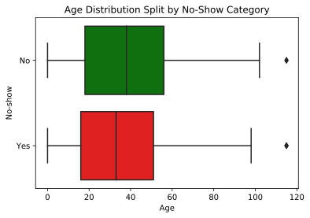
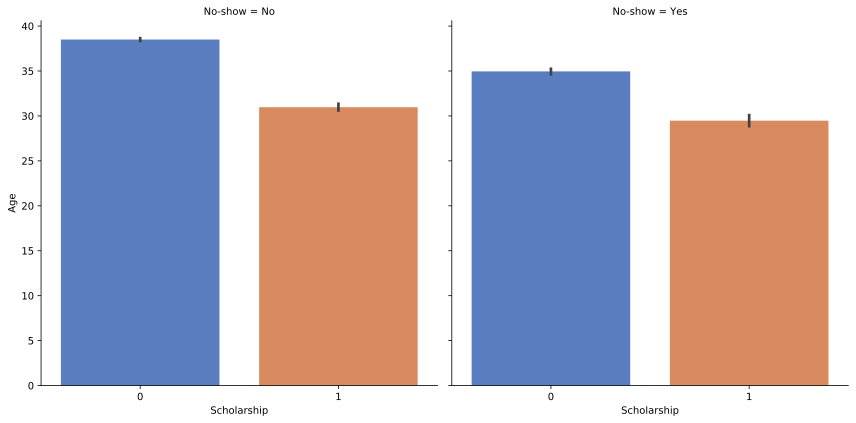

# Appointments with no-show patients
## Project :: Investigating a Data Set
<ul>
<li><a href="#intro">Introduction</a></li>
<li><a href="#wrangling">Data Wrangling</a></li>
<li><a href="#eda">Exploratory Data Analysis</a></li>
<li><a href="#conclusions">Conclusions</a></li>
</ul>


<a id='intro'></a>
## Introduction

> In this project I am using the ** No-Show Appointment Dataset** to analyse and answer some question using this dataset. These questions are:
>
> **1) Does age (younger or older) have any kind of impact or relationship in terms of people showing up for appointments or not?**
>
> **2) Does the combination of age and scholarship have some kind of impact or relationship in terms of people showing up for appointments or not?**
>


```python
'''Importing all the required packages'''

import pandas as pd # For working with dataset
import numpy as np # For working with numerical data
import matplotlib.pyplot as plt
import seaborn as sns #For better visualisation
%matplotlib inline

"""Defining function for the program"""

def show(dataframe, type):
    if type == "data":
        to_show=dataframe.head()
    if type == 'info':
        to_show=dataframe.info()
    if type == 'desc':
        to_show=dataframe.describe()
    if type == 'size':
        to_show=dataframe.shape
    return to_show
```

<a id='wrangling'></a>
## Data Wrangling

> When I tried to read this csv file I found an error :
> **“UnicodeDecodeError: 'utf-8' codec can't decode byte 0xed in position 3: invalid continuation byte”.**
> To solve this issue I used `encoding='latin-1'` in our code while reading this csv file.

### General Properties
> Loading this data set as df as it is short for use and also relates with term dataframe. The **df** contains all the dataset as availabe in the raw data set.


```python
DATA_URL='F:\\Github_repo\\Data-Analyst-Investigate-Dataset\\Data_set.csv'
encoding_type='latin-1'

df = pd.read_csv(DATA_URL, encoding=encoding_type)
df.head()
```


<div>
<style scoped>
    .dataframe tbody tr th:only-of-type {
        vertical-align: middle;
    }

    .dataframe tbody tr th {
        vertical-align: top;
    }

    .dataframe thead th {
        text-align: right;
    }
</style>
<table border="1" class="dataframe">
  <thead>
    <tr style="text-align: right;">
      <th></th>
      <th>PatientId</th>
      <th>AppointmentID</th>
      <th>Gender</th>
      <th>ScheduledDay</th>
      <th>AppointmentDay</th>
      <th>Age</th>
      <th>Neighbourhood</th>
      <th>Scholarship</th>
      <th>Hipertension</th>
      <th>Diabetes</th>
      <th>Alcoholism</th>
      <th>Handcap</th>
      <th>SMS_received</th>
      <th>No-show</th>
    </tr>
  </thead>
  <tbody>
    <tr>
      <th>0</th>
      <td>2.990000e+13</td>
      <td>5642903</td>
      <td>F</td>
      <td>2016-04-29T18:38:08Z</td>
      <td>2016-04-29T00:00:00Z</td>
      <td>62</td>
      <td>JARDIM DA PENHA</td>
      <td>0</td>
      <td>1</td>
      <td>0</td>
      <td>0</td>
      <td>0</td>
      <td>0</td>
      <td>No</td>
    </tr>
    <tr>
      <th>1</th>
      <td>5.590000e+14</td>
      <td>5642503</td>
      <td>M</td>
      <td>2016-04-29T16:08:27Z</td>
      <td>2016-04-29T00:00:00Z</td>
      <td>56</td>
      <td>JARDIM DA PENHA</td>
      <td>0</td>
      <td>0</td>
      <td>0</td>
      <td>0</td>
      <td>0</td>
      <td>0</td>
      <td>No</td>
    </tr>
    <tr>
      <th>2</th>
      <td>4.260000e+12</td>
      <td>5642549</td>
      <td>F</td>
      <td>2016-04-29T16:19:04Z</td>
      <td>2016-04-29T00:00:00Z</td>
      <td>62</td>
      <td>MATA DA PRAIA</td>
      <td>0</td>
      <td>0</td>
      <td>0</td>
      <td>0</td>
      <td>0</td>
      <td>0</td>
      <td>No</td>
    </tr>
    <tr>
      <th>3</th>
      <td>8.680000e+11</td>
      <td>5642828</td>
      <td>F</td>
      <td>2016-04-29T17:29:31Z</td>
      <td>2016-04-29T00:00:00Z</td>
      <td>8</td>
      <td>PONTAL DE CAMBURI</td>
      <td>0</td>
      <td>0</td>
      <td>0</td>
      <td>0</td>
      <td>0</td>
      <td>0</td>
      <td>No</td>
    </tr>
    <tr>
      <th>4</th>
      <td>8.840000e+12</td>
      <td>5642494</td>
      <td>F</td>
      <td>2016-04-29T16:07:23Z</td>
      <td>2016-04-29T00:00:00Z</td>
      <td>56</td>
      <td>JARDIM DA PENHA</td>
      <td>0</td>
      <td>1</td>
      <td>1</td>
      <td>0</td>
      <td>0</td>
      <td>0</td>
      <td>No</td>
    </tr>
  </tbody>
</table>
</div>


```python
show(df,"desc")
```


<div>
<style scoped>
    .dataframe tbody tr th:only-of-type {
        vertical-align: middle;
    }

    .dataframe tbody tr th {
        vertical-align: top;
    }

    .dataframe thead th {
        text-align: right;
    }
</style>
<table border="1" class="dataframe">
  <thead>
    <tr style="text-align: right;">
      <th></th>
      <th>PatientId</th>
      <th>AppointmentID</th>
      <th>Age</th>
      <th>Scholarship</th>
      <th>Hipertension</th>
      <th>Diabetes</th>
      <th>Alcoholism</th>
      <th>Handcap</th>
      <th>SMS_received</th>
    </tr>
  </thead>
  <tbody>
    <tr>
      <th>count</th>
      <td>1.105270e+05</td>
      <td>1.105270e+05</td>
      <td>110527.000000</td>
      <td>110527.000000</td>
      <td>110527.000000</td>
      <td>110527.000000</td>
      <td>110527.000000</td>
      <td>110527.000000</td>
      <td>110527.000000</td>
    </tr>
    <tr>
      <th>mean</th>
      <td>1.474961e+14</td>
      <td>5.675305e+06</td>
      <td>37.088874</td>
      <td>0.098266</td>
      <td>0.197246</td>
      <td>0.071865</td>
      <td>0.030400</td>
      <td>0.022248</td>
      <td>0.321026</td>
    </tr>
    <tr>
      <th>std</th>
      <td>2.560943e+14</td>
      <td>7.129575e+04</td>
      <td>23.110205</td>
      <td>0.297675</td>
      <td>0.397921</td>
      <td>0.258265</td>
      <td>0.171686</td>
      <td>0.161543</td>
      <td>0.466873</td>
    </tr>
    <tr>
      <th>min</th>
      <td>3.920000e+04</td>
      <td>5.030230e+06</td>
      <td>-1.000000</td>
      <td>0.000000</td>
      <td>0.000000</td>
      <td>0.000000</td>
      <td>0.000000</td>
      <td>0.000000</td>
      <td>0.000000</td>
    </tr>
    <tr>
      <th>25%</th>
      <td>4.170000e+12</td>
      <td>5.640286e+06</td>
      <td>18.000000</td>
      <td>0.000000</td>
      <td>0.000000</td>
      <td>0.000000</td>
      <td>0.000000</td>
      <td>0.000000</td>
      <td>0.000000</td>
    </tr>
    <tr>
      <th>50%</th>
      <td>3.170000e+13</td>
      <td>5.680573e+06</td>
      <td>37.000000</td>
      <td>0.000000</td>
      <td>0.000000</td>
      <td>0.000000</td>
      <td>0.000000</td>
      <td>0.000000</td>
      <td>0.000000</td>
    </tr>
    <tr>
      <th>75%</th>
      <td>9.440000e+13</td>
      <td>5.725524e+06</td>
      <td>55.000000</td>
      <td>0.000000</td>
      <td>0.000000</td>
      <td>0.000000</td>
      <td>0.000000</td>
      <td>0.000000</td>
      <td>1.000000</td>
    </tr>
    <tr>
      <th>max</th>
      <td>1.000000e+15</td>
      <td>5.790484e+06</td>
      <td>115.000000</td>
      <td>1.000000</td>
      <td>1.000000</td>
      <td>1.000000</td>
      <td>1.000000</td>
      <td>4.000000</td>
      <td>1.000000</td>
    </tr>
  </tbody>
</table>
</div>


```python
show(df,"info")
```

    <class 'pandas.core.frame.DataFrame'>
    RangeIndex: 110527 entries, 0 to 110526
    Data columns (total 14 columns):
     #   Column          Non-Null Count   Dtype  
    ---  ------          --------------   -----  
     0   PatientId       110527 non-null  float64
     1   AppointmentID   110527 non-null  int64  
     2   Gender          110527 non-null  object 
     3   ScheduledDay    110527 non-null  object 
     4   AppointmentDay  110527 non-null  object 
     5   Age             110527 non-null  int64  
     6   Neighbourhood   110527 non-null  object 
     7   Scholarship     110527 non-null  int64  
     8   Hipertension    110527 non-null  int64  
     9   Diabetes        110527 non-null  int64  
     10  Alcoholism      110527 non-null  int64  
     11  Handcap         110527 non-null  int64  
     12  SMS_received    110527 non-null  int64  
     13  No-show         110527 non-null  object 
    dtypes: float64(1), int64(8), object(5)
    memory usage: 11.8+ MB
    

### Performing Data Cleaning operation


> Taking a closer look at some aspects of the data from the above dataframes.
> The following few cells of code in this section are looking into the maximum listed age of 115.
> First create a sub-group of 'appt' dataframe where 'Age' column values are equal to '115'.


```python
age_max= df.query("Age == 115")
age_max
```


<div>
<style scoped>
    .dataframe tbody tr th:only-of-type {
        vertical-align: middle;
    }

    .dataframe tbody tr th {
        vertical-align: top;
    }

    .dataframe thead th {
        text-align: right;
    }
</style>
<table border="1" class="dataframe">
  <thead>
    <tr style="text-align: right;">
      <th></th>
      <th>PatientId</th>
      <th>AppointmentID</th>
      <th>Gender</th>
      <th>ScheduledDay</th>
      <th>AppointmentDay</th>
      <th>Age</th>
      <th>Neighbourhood</th>
      <th>Scholarship</th>
      <th>Hipertension</th>
      <th>Diabetes</th>
      <th>Alcoholism</th>
      <th>Handcap</th>
      <th>SMS_received</th>
      <th>No-show</th>
    </tr>
  </thead>
  <tbody>
    <tr>
      <th>63912</th>
      <td>3.200000e+13</td>
      <td>5700278</td>
      <td>F</td>
      <td>2016-05-16T09:17:44Z</td>
      <td>2016-05-19T00:00:00Z</td>
      <td>115</td>
      <td>ANDORINHAS</td>
      <td>0</td>
      <td>0</td>
      <td>0</td>
      <td>0</td>
      <td>1</td>
      <td>0</td>
      <td>Yes</td>
    </tr>
    <tr>
      <th>63915</th>
      <td>3.200000e+13</td>
      <td>5700279</td>
      <td>F</td>
      <td>2016-05-16T09:17:44Z</td>
      <td>2016-05-19T00:00:00Z</td>
      <td>115</td>
      <td>ANDORINHAS</td>
      <td>0</td>
      <td>0</td>
      <td>0</td>
      <td>0</td>
      <td>1</td>
      <td>0</td>
      <td>Yes</td>
    </tr>
    <tr>
      <th>68127</th>
      <td>3.200000e+13</td>
      <td>5562812</td>
      <td>F</td>
      <td>2016-04-08T14:29:17Z</td>
      <td>2016-05-16T00:00:00Z</td>
      <td>115</td>
      <td>ANDORINHAS</td>
      <td>0</td>
      <td>0</td>
      <td>0</td>
      <td>0</td>
      <td>1</td>
      <td>0</td>
      <td>Yes</td>
    </tr>
    <tr>
      <th>76284</th>
      <td>3.200000e+13</td>
      <td>5744037</td>
      <td>F</td>
      <td>2016-05-30T09:44:51Z</td>
      <td>2016-05-30T00:00:00Z</td>
      <td>115</td>
      <td>ANDORINHAS</td>
      <td>0</td>
      <td>0</td>
      <td>0</td>
      <td>0</td>
      <td>1</td>
      <td>0</td>
      <td>No</td>
    </tr>
    <tr>
      <th>97666</th>
      <td>7.480000e+14</td>
      <td>5717451</td>
      <td>F</td>
      <td>2016-05-19T07:57:56Z</td>
      <td>2016-06-03T00:00:00Z</td>
      <td>115</td>
      <td>Sí€O JOSíŠ</td>
      <td>0</td>
      <td>1</td>
      <td>0</td>
      <td>0</td>
      <td>0</td>
      <td>1</td>
      <td>No</td>
    </tr>
  </tbody>
</table>
</div>


```python
age_max['PatientId'].nunique() # Here I'm using the nunique() function of pandas to know the no. of unique values in the desired dataframe.
```


    2


```python
age_min= df.query("Age == -1")
df.Age.replace([-1],[0], inplace = True)
```


```python
show(df,"desc")
```


<div>
<style scoped>
    .dataframe tbody tr th:only-of-type {
        vertical-align: middle;
    }

    .dataframe tbody tr th {
        vertical-align: top;
    }

    .dataframe thead th {
        text-align: right;
    }
</style>
<table border="1" class="dataframe">
  <thead>
    <tr style="text-align: right;">
      <th></th>
      <th>PatientId</th>
      <th>AppointmentID</th>
      <th>Age</th>
      <th>Scholarship</th>
      <th>Hipertension</th>
      <th>Diabetes</th>
      <th>Alcoholism</th>
      <th>Handcap</th>
      <th>SMS_received</th>
    </tr>
  </thead>
  <tbody>
    <tr>
      <th>count</th>
      <td>1.105270e+05</td>
      <td>1.105270e+05</td>
      <td>110527.000000</td>
      <td>110527.000000</td>
      <td>110527.000000</td>
      <td>110527.000000</td>
      <td>110527.000000</td>
      <td>110527.000000</td>
      <td>110527.000000</td>
    </tr>
    <tr>
      <th>mean</th>
      <td>1.474961e+14</td>
      <td>5.675305e+06</td>
      <td>37.088883</td>
      <td>0.098266</td>
      <td>0.197246</td>
      <td>0.071865</td>
      <td>0.030400</td>
      <td>0.022248</td>
      <td>0.321026</td>
    </tr>
    <tr>
      <th>std</th>
      <td>2.560943e+14</td>
      <td>7.129575e+04</td>
      <td>23.110190</td>
      <td>0.297675</td>
      <td>0.397921</td>
      <td>0.258265</td>
      <td>0.171686</td>
      <td>0.161543</td>
      <td>0.466873</td>
    </tr>
    <tr>
      <th>min</th>
      <td>3.920000e+04</td>
      <td>5.030230e+06</td>
      <td>0.000000</td>
      <td>0.000000</td>
      <td>0.000000</td>
      <td>0.000000</td>
      <td>0.000000</td>
      <td>0.000000</td>
      <td>0.000000</td>
    </tr>
    <tr>
      <th>25%</th>
      <td>4.170000e+12</td>
      <td>5.640286e+06</td>
      <td>18.000000</td>
      <td>0.000000</td>
      <td>0.000000</td>
      <td>0.000000</td>
      <td>0.000000</td>
      <td>0.000000</td>
      <td>0.000000</td>
    </tr>
    <tr>
      <th>50%</th>
      <td>3.170000e+13</td>
      <td>5.680573e+06</td>
      <td>37.000000</td>
      <td>0.000000</td>
      <td>0.000000</td>
      <td>0.000000</td>
      <td>0.000000</td>
      <td>0.000000</td>
      <td>0.000000</td>
    </tr>
    <tr>
      <th>75%</th>
      <td>9.440000e+13</td>
      <td>5.725524e+06</td>
      <td>55.000000</td>
      <td>0.000000</td>
      <td>0.000000</td>
      <td>0.000000</td>
      <td>0.000000</td>
      <td>0.000000</td>
      <td>1.000000</td>
    </tr>
    <tr>
      <th>max</th>
      <td>1.000000e+15</td>
      <td>5.790484e+06</td>
      <td>115.000000</td>
      <td>1.000000</td>
      <td>1.000000</td>
      <td>1.000000</td>
      <td>1.000000</td>
      <td>4.000000</td>
      <td>1.000000</td>
    </tr>
  </tbody>
</table>
</div>


```python
show(df,"info")
```

    <class 'pandas.core.frame.DataFrame'>
    RangeIndex: 110527 entries, 0 to 110526
    Data columns (total 14 columns):
     #   Column          Non-Null Count   Dtype  
    ---  ------          --------------   -----  
     0   PatientId       110527 non-null  float64
     1   AppointmentID   110527 non-null  int64  
     2   Gender          110527 non-null  object 
     3   ScheduledDay    110527 non-null  object 
     4   AppointmentDay  110527 non-null  object 
     5   Age             110527 non-null  int64  
     6   Neighbourhood   110527 non-null  object 
     7   Scholarship     110527 non-null  int64  
     8   Hipertension    110527 non-null  int64  
     9   Diabetes        110527 non-null  int64  
     10  Alcoholism      110527 non-null  int64  
     11  Handcap         110527 non-null  int64  
     12  SMS_received    110527 non-null  int64  
     13  No-show         110527 non-null  object 
    dtypes: float64(1), int64(8), object(5)
    memory usage: 11.8+ MB
    

<a id='eda'></a>
## Exploratory Data Analysis

### Research Question 1 (single variable exploration): 
> **Does age (younger or older) have any kind of impact/ relationship in terms of people showing up for appointments or not?**
>
> In order to explore the above question I'm creating a copy of the 'df' dataframe to a new dataframe named as 'df_new' so that I have a backup of the original dataframe.
>
> Now, using the 'df_new' dataframe, I'm creating a boxplot and using column "Age"  as the x-axis and "No-show" for the y-axis.


```python
'''Here I am plotting a boxplot to analyse the relationship between "Age" and "Peoples present for appointments" '''

df_new= df
sns.boxplot(x="Age", y="No-show", palette=["g", "r"], data=df_new).set_title('Age Distribution Split by No-Show Category');
```





### Research Question 2 (multi-variable exploration):
>> **Does the combination of age and scholarship have any impact/ relationship with people showing up for appointments or not?**
>
> To Answer this question here I'm using `sns.catplot()` function of seaborn library to plot a bar grap between Scholarship-Age and peoples present for their appointments


```python
sns.catplot(x="Scholarship", y="Age", col="No-show", data=df_new, height=6, kind="bar", palette="muted");
```





### Research Question 3:
>> **Is there any relationship between the Diabetes disease and the peoples present for appointments?**
>
> This question help us to know that patients suffering from Diabetes disease are concious about there appointments or not? 
> To Answer this question here I'm using `sns.catplot()` function of seaborn library to plot a bar grap between Diabetes-Age and peoples present for their appointments


```python
sns.set(style="ticks")
sns.catplot(x="Diabetes", y="Age" , col="No-show", data=df_new);
```


<a id='conclusions'></a>
## Conclusions

> **Result**
>
> 1) Overall, there wasn't a huge difference in age for those who did or didn't show up to appointments. But I believe that the difference would have been higher for the group who did present for appointments rather that nearly 4 times larger than the group of people who aren't present for their appointments.
> 
> 2) While the age differences aren't very wide, the people who didn't show up to appointments tended to be younger and that is also the same for whether or not these 2 groups of people had healthcare scholarships. Also there is a fact that the **No-show=Yes** group is nearly 4 times smaller than the other group.
> 
> 3) Overall, after performing all the task I can conclude that there is not perfect evidence that either Age or Scholarship status have an strong relationship with people who were present for their appointment or not. Smaller number of people who were present for their appointments than who weren't might also can be a reason for this result.
>
> 4) Using the current dataset, I tried to make a relationship between age and No-show status of the patients. But It seems that there isn't any relationship between the Age and Disease and alsi it has no impact on appointments.

> **Limitations:**
>
> 1) Given that Scholarship only has 0 or 1 for possible answers - it was tough to find good visuals that would also be able to work with Scholarship and still provide some insight and be easy to understand.
>
> 2) Lots of the columns used categorical data which makes it more difficult to analyze and visualize. This in turn somewhat hinders the ability to find any strong correlations between columns.
>
> 3) Again, the unbalance split between the No-show Yes and No-show No groups did't allow for a truly balanced or equal analysis to be done but at the same time this uneven split showed some potentially interesting areas that could be further explored.
>
> 4) The Data given in this dataset is completely scattered and it looks like there isn't any relation between data with one another.


```python
from subprocess import call
call(['python', '-m', 'nbconvert', 'Investigate_a_Dataset.ipynb'])
```


    4294967295


